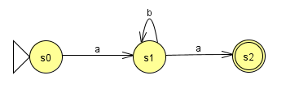

# AFD Exercício 2

Implementação java recursivo de um Autômato Finito Determinístico(AFD) que reconhece a linguagem:

L = {w &isin; {a,b}* | w possui o prefixo **a** um quantidade qualquer de **b** e o sufixo com **a**}
- Ex.: aba, abba, abbba, abbbba, .... 

Definição da linguagem:
- L = <{a, b}, {s0, s1, s2}, s0, δ, {s2}>, 
- onde δ é:
    - δ{s0,a) = s1
    - δ{s1,b) = s1
    - δ{s1,a) = s2

AFD:

Arquivo JFlap:
[AF_ex2_v1.jff](AFD_ex2_v1.jff)